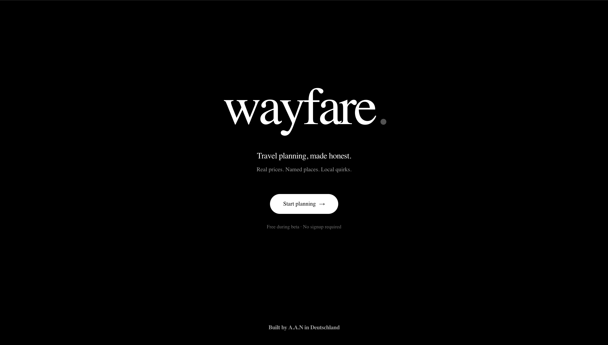
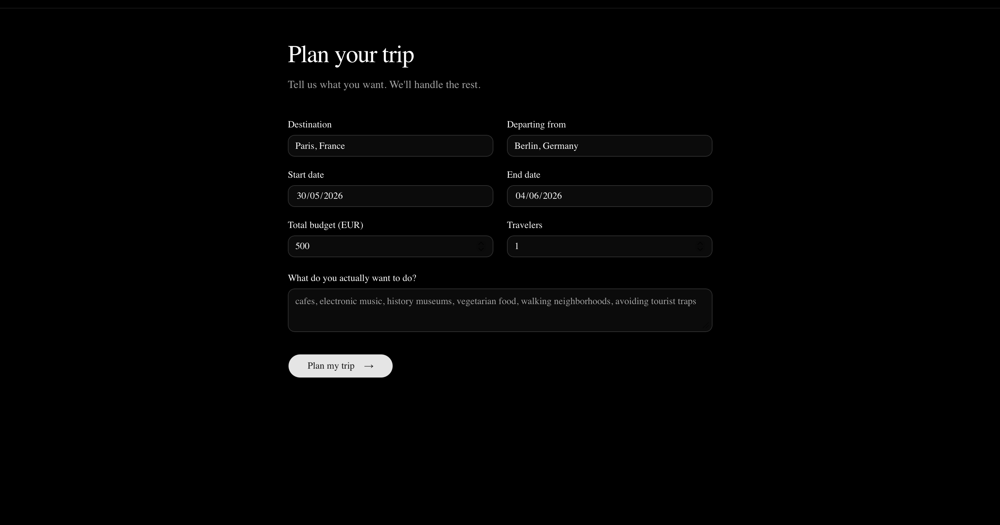
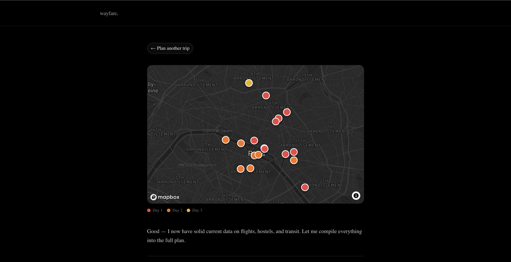

# wayfare

A travel planner that gives honest, current advice instead of the generic stuff every other AI travel app spits out.

**Live demo:** https://wayfare-xi.vercel.app

## The idea

I got annoyed with how every AI travel assistant gives you the same vague recommendations. ChatGPT tells you to "immerse yourself in the local culture" and visit "popular landmarks." It can't tell you what an Oyster card actually costs in London right now, or that the Pergamon Museum in Berlin is half-closed for renovation, or that you'll get your phone snatched if you stand on a Shoreditch curb with it out.

So I built wayfare. It uses an LLM with real-time web search to give you:

- Real current prices for flights, hostels, and transit (looked up live, not pulled from training data)
- Named restaurants and cafes with actual addresses, not "try some local food"
- Safety briefings with specific pickpocket hotspots
- Local quirks (which side of the escalator to stand on, exact tipping etiquette)
- Honest budget checks that say "this isn't realistic" when it isn't
- A map with day-color-coded pins so you can see where everything is

It's supposed to feel like advice from a friend who actually lives in the city you're visiting, not a chatbot quoting Wikipedia.

## Screenshots







## What's actually different from other AI travel tools

I tried Wonderplan, Layla, Mindtrip, and ChatGPT before building this. They all do roughly the same thing: pretty UI wrapped around generic LLM output. Wayfare's differences:

**Web search is forced, not optional.** Every response runs 4 live searches in parallel to verify prices and conditions before any recommendation is made. The prompt explicitly bans the model from using vague words like "around" or "approximately" — it has to give real numbers or mark uncertain ones with "(verify current)".

**The prompt is hostile to AI clichés.** The system prompt has rules like "never write 'immerse yourself in the vibrant culture'" and "if a place is touristy and not worth it, say so." Most AI tools won't tell you something sucks. Mine will.

**Honest budget feasibility check.** If you say "€400 for 7 days in London," it tells you that doesn't work and shows what does. Generic AI tools pretend everything is doable.

**Map with day-color-coded pins.** Every place from the itinerary gets a Mapbox pin colored by which day you visit it. So you can see at a glance whether the plan is geographically sensible or has you crossing the city three times in one day.

**Safety briefing that's actually specific.** Not "be aware of your surroundings" — specific. "Moped phone snatchings happen on Shoreditch High Street, Old Street roundabout, and Bethnal Green Road. Don't stand on the curb with your phone out."

## Tech stack

- **Next.js 15** with App Router and TypeScript
- **Tailwind CSS** + **shadcn/ui** for the design system
- **Groq API** running **Llama 3.3 70B** as the language model (free tier)
- **Tavily Search API** for real-time web search (free tier, 1000 searches/month)
- **Mapbox GL JS** for the map visualization
- **Streaming responses** via ReadableStream so output appears as it's generated
- **Vercel** for hosting, auto-deploys on every git push
- **GitHub** for version control

There's also an earlier Python + Streamlit prototype I used to validate the prompt and approach before building the proper Next.js version. The first production version actually ran on Anthropic's Claude API — I migrated to Groq + Tavily later for cost reasons (see "Hard parts" below).

## How it actually works

When you submit the form:

1. The form posts to `/api/plan`, a Next.js API route
2. The route takes your destination, dates, budget, and interests and builds 4 targeted search queries: flights, transit, accommodation, and attractions
3. All 4 searches run in parallel through Tavily for speed
4. Search results get packaged into one prompt with strict formatting rules
5. That prompt goes to Groq running Llama 3.3 70B with streaming enabled
6. The response streams back token by token via a ReadableStream
7. The frontend reads the stream and updates the page in real time
8. At the very end of the response, the model outputs a JSON block listing every named place with lat/lng coordinates
9. The frontend parses that JSON, hides it from the visible text, and renders the places as colored pins on a Mapbox map

The whole thing runs on Vercel's serverless functions, which have a 60-second timeout on the free tier — manageable because parallel searches finish in 3-5 seconds and Groq streams very fast (~300 tokens/second on Llama 70B).

## Hard parts I had to figure out

**Migrating from Anthropic to free APIs.** The first production version used Claude with Anthropic's built-in web_search tool, which cost about €0.20 per trip. That adds up fast when sharing with friends. Migrated to Groq (free Llama 3.3 70B) + Tavily (1000 free searches/month) for €0/month forever. The migration was tricky because Llama's tool calling is unreliable on Groq — it sometimes generates `<function>...</function>` tags instead of the standard JSON format Groq expects, which crashes the parser. Solved by dropping dynamic tool calling entirely and switching to predefined parallel searches based on the form input. Less flexible than Claude's adaptive approach but 100% reliable and noticeably faster.

**Vercel's 60-second timeout.** Early versions timed out constantly because the LLM takes 30-60 seconds to do searches before any text comes out. Fix was switching to streaming responses — Vercel keeps the function alive as long as data is flowing, even past 60 seconds.

**Stopping the LLM from leaking JSON into the visible output.** The model is supposed to put the place-list JSON at the end in a code block, but it sometimes drops the code fences. I ended up writing a parser that finds the JSON by looking for the earliest marker among three options (a `## Map data` heading, a triple-backtick json fence, or a raw `[{...` array containing `"lat"`) and cuts everything from that point onward out of the display text.

**API key leaks.** Made the classic mistake early on of pasting an API key directly into a code file. Had to revoke and regenerate. Now I'm religious about `.env.local` and `.gitignore`.

**Map coordinates from an LLM.** The model knows lat/lng for famous places but approximates for obscure ones. Some pins land a few hundred meters off the real spot. Mapbox geocoding would fix this but adds another API call per place — left it as-is for v1.

## Known limitations

Being honest about what's not great:

- Coordinates from the LLM are sometimes slightly off for obscure venues
- No saved trips yet — refreshing the page loses your itinerary. localStorage for this is planned
- English only
- Response takes 30-60 seconds — fast streaming after the parallel searches finish
- Single user, no accounts. Trips aren't saved or shareable
- Tavily free tier caps at 1000 searches/month (~250 trips). Plenty for personal/portfolio use but would need a paid plan if it ever got popular
- Llama 3.3 70B is solid but less polished than Claude in nuance and structured output

## What I actually learned building this

- How to structure a prompt for forcing specific output format (and how easily models ignore your rules if you're not strict)
- How streaming LLM responses work on serverless platforms and why they're necessary for anything that takes longer than a few seconds
- The difference between a working local demo and a deployable production app is almost entirely error handling and edge cases
- How Next.js App Router separates server and client code
- Why "just use the LLM output directly" doesn't work — you always need a parser
- How to debug bugs that only happen in production (the worst kind)
- API key hygiene the hard way
- Trade-offs between paid LLM providers with built-in tools vs. free providers with manual wiring — and when the migration is worth doing

## Running it locally

You need:

- Node.js 20 or higher
- A Groq API key from [console.groq.com](https://console.groq.com) (free)
- A Tavily API key from [tavily.com](https://tavily.com) (free)
- A Mapbox public token from [account.mapbox.com](https://account.mapbox.com) (free)

```bash
git clone https://github.com/aamirabbas858/wayfare.git
cd wayfare
npm install
```

Create `.env.local` in the project root:

```
GROQ_API_KEY=gsk_...
TAVILY_API_KEY=tvly-...
NEXT_PUBLIC_MAPBOX_TOKEN=pk.eyJ1...
```

Then:

```bash
npm run dev
```

Open `http://localhost:3000`.

## What's next

- localStorage to remember recent trips
- Custom domain
- Maybe a Supabase database for shareable, persistent trips
- Better mobile layout on the planner page

## About me

I'm a CS undergrad at BSBI Berlin, building this in the evenings around classes and a part-time bakery job. Trying to learn what it actually takes to ship something real, not just finish coursework.

Reach me: [your email or LinkedIn URL]
